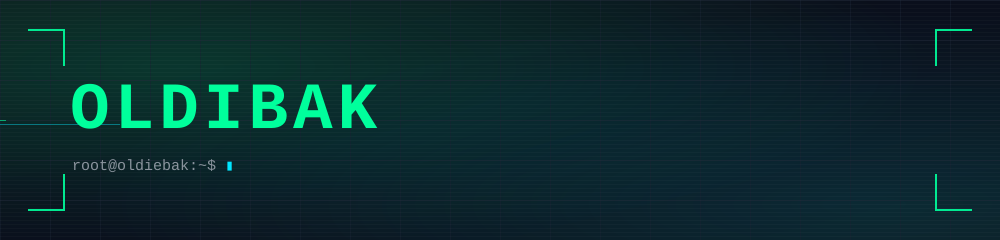

---

### 🛠️ Tech Stack · 技术栈

  
  

---

### 📌 仓库展示 · Repositories

| 项目 / Project | 说明 / Description |
| --- | --- |
| 🔐 [**H1ve**](https://github.com/oldiebak/H1ve) | 一体化 CTF 平台 / Integrated CTF Platform |
| 📡 [**ZLMediaKit**](https://github.com/oldiebak/ZLMediaKit) | 流媒体服务器框架 / Streaming media server framework |
| 📦 [**xm4a**](https://github.com/oldiebak/xm4a) | 定制编译 OpenWrt 固件 / Custom OpenWrt firmware build |
| 🎨 [**hexo-theme-volantis**](https://github.com/oldiebak/hexo-theme-volantis) | 精致的 Hexo 主题 / A Wonderful Hexo Theme |

---

### 🐍 Contribution · 贡献

  <picture>
    <source media="(prefers-color-scheme: dark)" srcset="https://raw.githubusercontent.com/oldiebak/oldiebak/output/github-contribution-grid-snake-dark.svg">
    <source media="(prefers-color-scheme: light)" srcset="https://raw.githubusercontent.com/oldiebak/oldiebak/output/github-contribution-grid-snake.svg">
    
  </picture>

